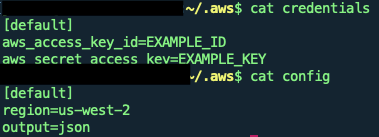
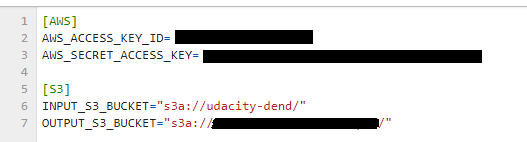

# Data Lake with Spark and AWS S3 

## Table of contents
- [Introduction](#introduction)
- [Project Description](#project-description)
- [Project Datasets](#project-datasets)
  * [Song dataset](#song-dataset)
  * [Log dataset](#log-dataset)
- [Technologies](#technologies)
- [Setup](#setup)
- [Files](#files)
- [Tables](#tables)
  * [Dimension Tables](#dimension-tables)
  * [Tables Partitioning](#tables-partitioning)
- [Performance](#performance)
- [Analytics](#analytics)
  * [Top 3 played songs](#top-3-played-songs)
  * [Top 3 artists](#top-3-artists)
  * [Top 3 hours listening activity](#top-3-hours-listening-activity)

## Introduction
This project is one of Udacitys Data Engineering Nano Degree projects. It is requested in the 3rd course: Data Lakes with Spark.

You are required to build a Data Lake that extracts data from AWS S3 buckets\, process the data into analytics tables using Spark to creates a set of facts/dimensions tables representing a star schema in a separate analytics directory on S3.

## Project Description
>A music streaming startup, Sparkify, has grown their user base and song database even more and want to move their data warehouse to a data lake. Their data resides in S3, in a directory of JSON logs on user activity on the app, as well as a directory with JSON metadata on the songs in their app.

>As their data engineer, you are tasked with building an ETL pipeline that extracts their data from S3, processes them using Spark, and loads the data back into S3 as a set of dimensional tables. This will allow their analytics team to continue finding insights in what songs their users are listening to.

## Project Datasets
There are two datasets residing in S3:

- **Song data:** `s3://udacity-dend/song_data`
- **Log data:** `s3://udacity-dend/log_data`

### Song dataset
- Subset of [Million Song Dataset](http://millionsongdataset.com/)
- JSON files
- Sample:

```{"num_songs": 1, "artist_id": "ARJIE2Y1187B994AB7", "artist_latitude": null, "artist_longitude": null, "artist_location": "", "artist_name": "Line Renaud", "song_id": "SOUPIRU12A6D4FA1E1", "title": "Der Kleine Dompfaff", "duration": 152.92036, "year": 0}```

### Log dataset
- Generated by [Event Simulator](https://github.com/Interana/eventsim)
- JSON files
- Sample:


## Technologies
- Python 3
- AWS S3
- AWS EMR (Spark\, Jupyter)

## Setup
- Create an SSH Key Pair to securely connect to your EMR cluster
 - ```EC2 >> Key Pairs (On the left side) >> Create Key Pair >> Give it a name >> Create```
 - A `.pem` will be downloaded, this is one half of the key pair and Amazon will put the other on the cluster.
 - Only when you have both keys together will you be able to connect to the machine
- Create an EMR cluster with the previously created EC2 Key Pair
- When the cluster is up and running, we will want to connect to it via SSH
 - Install `python` and AWS CLI `pip install awscli`
 - Check if AWS CLI is installed correctly by typing `aws`
 - Create an access key for your AWS CLI
  - ```AWS IAM Console >> Dashboard >> Expand Delete your root access keys >> Manage Security Credentials >> Expand Access keys >> Create New Access Key```
  - Store your key pair in a secure place, ***you will not be able to view it again***
 - Open a new terminal and navigate to your home folder `cd`
 - Create a hidden directory `mkdir .aws`
 - Type `aws config` and fill up ***the access key***, ***the secret key*** and ***the region***
 - A file called `credentials` and a file called `config` will be created inside `.aws`
 
  
 - To describe the status of your cluster type in the terminal `aws emr describe-cluster --cluster-id <YOUR_CLUSTER_ID>`
 - Go to your cluster summary\, press on `Security groups for Master`\, open master node security group and add an inbound role with type `ALL TRAFIC` and source `0.0.0.0/0`
 - Install ***FoxyProxy*** on your Chrome or Firefox browser and configure it as mentioned in `Enable an SSH Connection` in your cluster summary page
 - In your terminal, type ```ssh -i spark-cluster.pem hadoop@<YOUR_MASTER_PUBLIC_DNS> -ND 8157``` to enable SSH to your cluster and allow access to web applications
 - To copy a file to your cluster, open a new terminal, `cd` to `.aws folder` and type ```scp -i <YOUR_PEM_FILE> <PATH_TO_FILE_IN_LOCAL> hadoop@<YOUR_MASTER_PUBLIC_DNS>:<PATH_IN_HDFS>```
 - Leave the previous terminal and open a new one
 - Type ```ssh -i spark-cluster.pem hadoop@<YOUR_MASTER_PUBLIC_DNS>``` to open an SSH connection to your clusters master node
 - Upload both `etl.py` and `dl.cfg` to the cluster 
- Add your access key and your secret key in `dl.cfg` file
- Add your S3 bucket paths ***(with a / at the end)*** in `dl.cfg` file
 
- In you cluster SSH connection terminal, use ```spark-submit <PATH_IN_HDFS>/etl.py``` to submit your application to spark

## Files
- `dl.cfg`: Contains configuration parameters
- `etl.py`: Connects to source S3 bucket then loads and creates star schema in destination S3 bucket
- `project_notebook.ipynb`: EMR Jupyter Notebook. Connects to analytics directory on S3 and perform some analytics

## Tables
### Dimension Tables
- Dimension tables are loaded from source S3 bucket
- We have 1 fact table and 4 dimension tables:
 - `songplays`: Fact table - Contains all logged events related to playing a song
 - `users`: Dimension table - Contains data of all users
 - `songs`: Dimension table - Contains records of all songs
 - `artists`: Dimension table - Contains records of all artists
 - `time`: Dimension table - Contains start time for songs played
 
### Tables Partitioning
- Each of the five tables are written to parquet files in a separate analytics directory on S3
- Each table has its own folder within the directory
- ***songs table*** files are partitioned by ***year*** and then ***artist_id***
- ***time table*** files are partitioned by ***year*** and ***month***
- ***songplays table*** files are partitioned by ***year*** and ***month***

## Performance

- ***songs table*** has ***12,620 partitions***\, the largest partition contains 7 records. It takes too much time to load this table because of that.

| year | artist_id          | counter |
|------|--------------------|---------|
| 0    | ARR3ONV1187B9A2F59 | 7       |
| 0    | ARSF0K11187B9AF319 | 6       |
| 0    | AROF4LP1187FB41C51 | 6       |

- I defined the schema manually when reading the JSON files\, instead of letting spark infer it\, to speed up the application
- I also added `spark.conf.set("mapreduce.fileoutputcommitter.algorithm.version", "2")` to speed up writing to S3
- The application finishes in ~29 minutes
- ***Reference:*** [Some issues when building an AWS data lake using Spark and how to deal with these issues](https://towardsdatascience.com/some-issues-when-building-an-aws-data-lake-using-spark-and-how-to-deal-with-these-issues-529ce246ba59)

## Analytics
For the full code\, you can check `project_notebook.ipynb`
### Top 3 played songs
#### Code
```
top3PlayedSongs = songplays.join(songs,songplays.song_id == songs.song_id,"left")\
                          .select(songplays.song_id,songs.title).where(songplays.song_id.isNotNull())
top3PlayedSongs = top3PlayedSongs.groupBy(col("song_id"),col("title")).count().orderBy(desc("count")).limit(3)
top3PlayedSongs.show()
```
#### Result
|           song_id|         title|count|
|------------------|--------------|-----|
|SOBONKR12A58A7A7E0|You're The One|   37|
|SOTTKFE12A6D4F9AFE|       Secrets|   17|
|SORKXUL12AB01821DA|          Home|   13|

### Top 3 artists
#### Code
```
spark.sql("""
                SELECT t2.name, count(*) 
                FROM songplays AS t1 
                JOIN artists AS t2 ON t1.artist_id = t2.artist_id 
                GROUP BY t2.name 
                ORDER BY count(*) DESC 
                LIMIT 3
""").show()
```
#### Result
|            name|count(1)|
|----------------|--------|
|   Dwight Yoakam|      37|
|Carleen Anderson|      17|
|   Frozen Plasma|      13|

### Top 3 hours listening activity
#### Code
```
spark.sql("""
            SELECT t2.hour, count(*) 
            FROM songplays AS t1 
            JOIN time AS t2 ON t1.start_time = t2.start_time 
            GROUP BY t2.hour 
            ORDER BY count(*) DESC 
            LIMIT 3
""").show()
```
#### Result
|hour|count(1)|
|----|--------|
|  16|     560|
|  18|     527|
|  17|     509|

